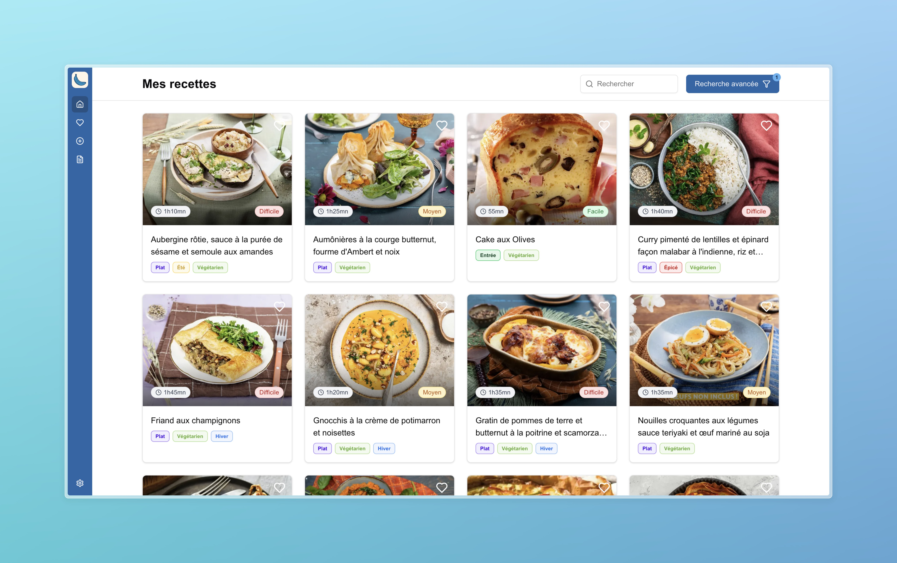

# Coquo

<div align="center">


[](https://opensource.org/licenses/MIT)
[](https://hub.docker.com/r/atocqueville/coquo)
[](https://github.com/atocqueville/coquo/issues)
[](https://github.com/atocqueville/coquo/stargazers)

**Self-hosted recipe manager built with modern web technologies**
</div>

## Introduction

Coquo is a modern, self-hosted recipe management application built with Next.js. It allows you to save, organize, and search your favorite recipes in a clean, user-friendly interface that's accessible from any device.

> ⚠️ **Note**: This project is still under active development!

## Features

- 📱 **Progressive Web App** - Install on any device and access your recipes offline
- 🏷️ **Tag organization** - Create and assign tags to keep your recipes organized
- 🔒 **Self-hosted** - Keep your recipe data private and under your control
- ⏰ **Keep screen awake** - Prevent your device from sleeping while cooking
- 🔐 **Whitelist management** - Grant or revoke user access to your recipe collection
- 🌐 **Internationalization** - Support for multiple languages (EN, FR)

## Features to Come

- 🖨️ **Print-friendly format** - Print your recipes with a clean layout
- 🌙 **Dark mode** - Easy on the eyes during those late-night cooking sessions
- 🔔 **Push notifications** - Stay updated with recipe reminders
- 🔄 **Recipe import** - Import recipes from popular cooking websites with cheerio
- 💬 **Comments** - Add notes and comments to each recipe

## Preview



## Usage

- with docker compose (**recommended**)

```
services:
  coquo:
    container_name: coquo
    image: atocqueville/coquo:latest
    ports:
      - 3030:3000
    volumes:
      - ./config:/config
    environment:
      - AUTH_URL=**insert your production domain**/api/auth
      - AUTH_SECRET="insert a hash secret"
```

### Add Google Sign In Provider

To enable Google Sign In, you'll need to set up OAuth credentials in the Google Cloud Console:

1. **Create a Google Cloud Project** (if you don't have one):
   - Go to the [Google Cloud Console](https://console.cloud.google.com/)
   - Create a new project or select an existing one

2. **Create OAuth 2.0 Credentials**:
   - Go to "APIs & Services" > "Credentials"
   - Click "Create Credentials" > "OAuth 2.0 Client IDs"
   - Select "Web application" as the application type
   - Add:
     - Authorized Javascript origins: `https://yourdomain.com`
     - Authorized redirect URIs: `https://yourdomain.com/api/auth/callback/google`

3. **Configure Environment Variables**:
```
 services:
  coquo:
    container_name: coquo
    image: atocqueville/coquo:latest
    ports:
      - 3030:3000
    volumes:
      - ./config:/config
    environment:
      - AUTH_URL=****
      - AUTH_SECRET=****
      - AUTH_GOOGLE_ID=your_google_client_id
      - AUTH_GOOGLE_SECRET=your_google_client_secret
```

**Note**: Make sure your `AUTH_URL` environment variable matches your production domain for the OAuth callbacks to work correctly.

## Development

Start the development server (using pm2):

```bash
yarn install
yarn prisma:reset # Remove your eventual existing database, creates an empty one and plays migrations

yarn dev:start # Start the Coquo web app on port 3000 + Prisma Studio on port 5555
```

Stop the development server:

```bash
yarn dev:stop
```

You can then log in with the combo `alex@admin.io` / `azerty` at http://localhost:3000

## Tech Stack

- [Next.js](https://nextjs.org/) - React framework
- [Prisma](https://www.prisma.io/) - Database ORM and toolkit
- [Auth.js](https://authjs.dev/) - Authentication library
- [Docker](https://www.docker.com/) - Containerization

## Contributing

Contributions are welcome! Please feel free to submit a Pull Request.

## License

This project is licensed under the MIT License - see the [LICENSE](LICENSE) file for details.
